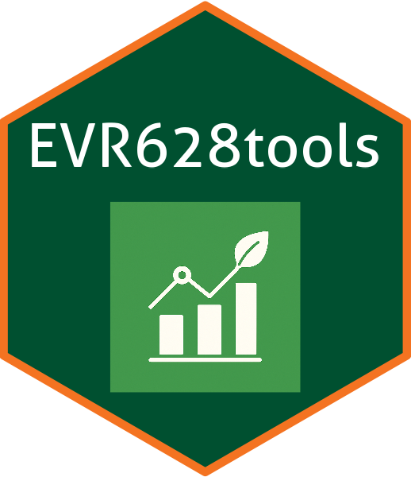

<!-- README.md is generated from README.Rmd. Please edit that file -->

```{r, include = FALSE}
knitr::opts_chunk$set(
  collapse = TRUE,
  comment = "#>",
  fig.path = "man/figures/README-",
  out.width = "100%"
)
```

# EVR628tools <a href="https://jcvdav.github.io/EVR628tools/index.html"></a>

<!-- badges: start -->
[](https://github.com/jcvdav/EVR628tools/actions/workflows/R-CMD-check.yaml)
<!-- badges: end -->

`EVR628tools` contains a series of datasets, palettes, and functions to help in
the instruction of [EVR 528 / 628 Introduction to Data Management and Visualization for Environmental Scientists](https://jcvdav.github.io/EVR_628/).

## Installation

You can install the development version of EVR628tools like so:

``` r
# install.packages("pak") #In case you don't have pak installed
pak::pak("jcvdav/EVR628tools")
```

## Example

The package contains functions with the preface `data_*` and `palette_*`. The following example uses one of each. Take a look at the [Reference](./reference/index.html) to see a full list of datasets and functions available. The task at hand is simple. We'll use the `EVR628tools::data_lionfish` data to make a plot showing how fish size (length and weight) varies by depth using a scatterplot. We'll use the `EVR628tools::palette_UM()` color palette to color our points by site. I recommend that you look at the documentation of the data `?EVR628tools::data_lionfish` and the color palette `EVR628tools::palette_UM()` before running the code.

```{r example}
#| fig-width: 8
#| fig-height: 5
#| fig-align: center
#| fig-cap: "Sample figure using data and color palettes from the `EVR628tools` package. The x-axis shows depth of collection (m) and the y-axis shows fish total length (cm). Marker size idnicates the wet weight of the fish, and marker color the site from which it was sampled."

library(ggplot2)

# First, inspect the data
head(EVR628tools::data_lionfish)

# Now let's build a plot
ggplot(data = EVR628tools::data_lionfish,
       mapping = aes(x = depth_m,
                     y = total_length_mm,
                     size = total_weight_gr,
                     fill = site)) +
  geom_point(shape = 21, color = 1) +
  scale_fill_manual(values = EVR628tools::palette_UM(n = 10)) +
  theme_bw() +
  labs(x = "Depth (m)",
       y = "Total Length (mm)",
       size = "Total Weight (gr)",
       fill = "Site")

```
